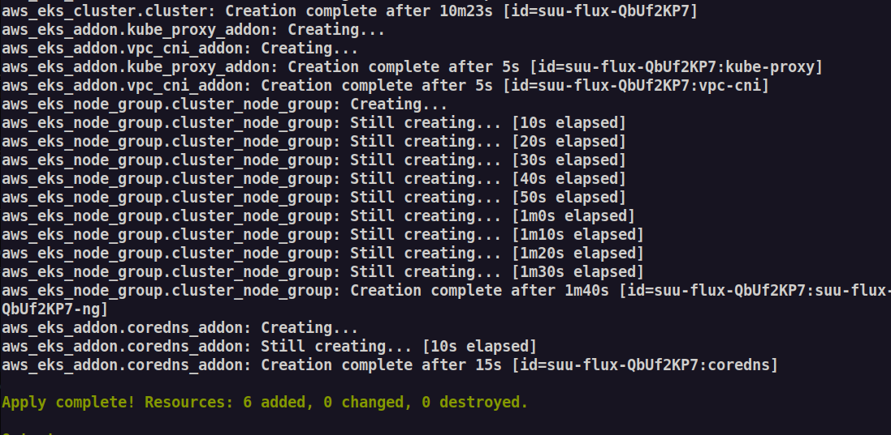

# Flux-19

## Project created for the Environment of Services Implementation course, 8th semester, academic year 2022/2023

## Authors

- Barbara Kulawska ([@bkulawska](https://github.com/bkulawska))
- Joanna Fortuna ([@Yoanka](https://github.com/Yoanka))
- Hubert Czader ([@HubertCzader](https://github.com/HubertCzader))
- Szymon Stępień ([@Fl0k3n](https://github.com/Fl0k3n))

## Contents list

1. [Introduction](#1-introduction)
2. [Theoretical background](#2-theoretical-background)
3. [Case study concept description](#3-case-study-concept-description)
4. [Solution architecture](#4-solution-architecture)
5. [Environment configuration description](#5-environment-configuration-description)
6. [Installation method](#6-installation-method)
7. [How to reproduce - step by step](#7-how-to-reproduce---step-by-step)
8. [Demo deployment steps](#8-demo-deployment-steps)
9. [Summary – conclusions](#9-summary--conclusions)
10. [References](#10-references)

## 1. Introduction

The aim of this project is to conduct a brief analysis of GitOps technologies and then create a system based on these technologies. The project will utilize the Kubernetes environment to automatically update applications according to the GitOps approach. To achieve this, the Flux tool will be used to deploy and automatically manage application infrastructure in the considered environment. The project will be focused on presenting a practical example with a step-by-step reproduction guide.

## 2. Theoretical background

### GitOps

GitOps is a modern approach to software delivery that emphasizes the use of version control and continuous delivery for managing infrastructure and applications<sup>[[1]](#1-httpswwwatlassiancomgittutorialsgitops)</sup>.

GitOps works particularly well with Kubernetes, which is an open-source container orchestration platform that automates many aspects of deploying, scaling, and managing containerized applications. By using GitOps with Kubernetes, organizations can benefit from the declarative infrastructure model that Kubernetes provides, as well as the ability to manage application configuration and deployment using Git.

This approach can help teams move faster, reduce errors, and increase agility by enabling them to manage their infrastructure and applications as code.

Additionally, GitOps makes it easier to enforce best practices and security policies, since all changes to the infrastructure and applications are made through pull requests that are subject to code review and approval.

### Flux

Flux is an open-source tool that enables GitOps workflows for Kubernetes. It works by synchronizing Kubernetes cluster state with a Git repository, making it easy to manage and automate deployments, rollbacks, and other changes to Kubernetes infrastructure<sup>[[2]](#2-httpsfluxcdiofluxconcepts)</sup>.

With Flux, developers can declare their desired state in a Git repository, and Flux will ensure that the Kubernetes cluster matches that state. This means that infrastructure changes can be versioned, audited, and automated in a way that is scalable and reliable.

The main functionalities of Flux include:

- GitOps synchronization and automated deployment - state of a cluster is declared in a git repository and is automatically updated when repositotory content changes. Its easy to see in what state the cluster currently is and what is deployed, we just need to check the main branch of a git repository.
- Rollback and recovery - all it takes to rollback an update is to revert the state of a git repository, Flux will automatically restore old cluster state.
- Image automation - Flux supports automatic image updates, ensuring that the application always runs on the latest version of the container image, this is particularly useful if we have CI/CD pipelines that build, test and push such images automatically.
- Notifications - Flux can send notifications about cluster state changes to platforms such as Discord or Slack.
- Enhanced security - thanks to the pull model of Flux we don't need to give a cluster administrator level access to CI/CD pipelines that would normally push those changes to the cluster.

---

### How does Flux work?

First we need to install it in the cluster, this process is called bootstrapping and can be performed using the Flux CLI. Once installation is finished we can see that Flux created a couple of controllers<sup>[[3]](#3-httpsfluxcdiofluxflux-e2e)</sup>, most importantly:

- **Source Controller** - agent responsible for pulling Commit data (kubernetes manifests such as deployments or services) into the cluster.
- **Kustomize Controller** - agent responsible for reconciling the cluster state with the desired state as defined by Commit manifests retrieved through Source controller.
- **Image Reflector Controller** and **Image Automation Controller** - agents responsible for monitoring image repositories (e.g. DockerHub) and reflecting image metadata in Kubernetes resources.
- **Notification Controller** - agent responsible for handling notifications.

Figure below illustrates one of the functionallities outlined before - image automation<sup>[[4]](#4-httpsanaisurlcomfull-tutorial-getting-started-with-flux-cd)</sup>.


The more important steps include:

- User pushes a new version of a docker image (either manually or through CI/CD pipeline).
- Flux detects that the image tag has changed.
- Flux updates relevant Kubernetes manifests (by changing image version in respective deployment files) and applies those changes to the git repository automatically.
- Flux reconciles the state of the cluster with the desired state of the git repository - in this case it just updates the application.

It works similarly if we update the git repository manually, Flux will detect those changes and reflect them in the cluster.

## 3. Case study concept description

In our project, we will focus on demonstrating the Flux tool by using it to perform GitOps on an examplatory application.

1. **Set up a Kubernetes cluster**: First, we need to have a Kubernetes cluster set up. To do so, we are going to use Amazon Web Services as our cloud provider. We will use our free lab account which has about `100$` resources to spend and configure the cluster automatically with terraform.

2. **Install Flux on the cluster**: Once we have a Kubernetes cluster, the next step is to install Flux. We're going to do this by following the installation guide on the Flux website.

3. **Add examplatory application code to the GitHub repository**: In the next step, in this existing repository that we have here, we are going to add our examplatory application code.

4. **Configure Flux to use the GitHub repository**: Once we have a GitHub repository with application code, we need to configure Flux to use the repository. To do this, we need to create a GitRepository custom resource in Kubernetes that contains the details of the GitHub repository. This will be done using kubectl or by writing a YAML file and applying it to the cluster.

5. **Add manifests to the GitHub repository**: With Flux configured to use the GitHub repository, we can start adding manifests to the repository. These manifests will define the resources that make up the application, such as deployments, services, and ingresses. We might use tools like kustomize or Helm to generate these manifests.

6. **Deploy the application**: With the manifests in the GitHub repository, Flux will automatically deploy the application to the Kubernetes cluster. Whenever we make changes to the manifests in the GitHub repository, Flux will automatically update the deployment to reflect the changes.

7. **Make changes to the repository**: Now, we will test if Flux is working correctly. We will make some changes to application; those changes can include updating manifests, adding new resources, or making changes to existing files. Then we will commit and push those changes back to the repository.

8. **Wait for Flux to pick up changes**: Once we push the changes to the repository, we will need to wait for Flux to pick up the changes. Flux typically checks the repository for changes every few minutes, so it may take a few minutes for the changes to be detected.

9. **Check if the changes have been applied**: Finally, we will check the Flux logs and the state of the cluster to see if the changes have been applied.

10. **Test performance**: Once we have demonstrated the use of the Flux tool, we can proceed to test the Flux tool using metrics such as the speed and frequency of its updates.

## 4. Solution architecture

The project involves implementing a system solution using Flux and a Kubernetes cluster on AWS, using the GitOps approach. The system architecture consists of several components, including AWS Kubernetes Cluster, GitOps, Elastic Kubernetes Service (EKS), Docker, Kubernetes, Git repository and Continuous Integration and Delivery (CI/CD). Below is a description of each element of architecture: 

- A Kubernetes cluster will be created on AWS, where Flux will act as a GitOps tool. As a result, the state of the cluster will be defined by the Git repository, and Flux will monitor the Git repositories and automatically update the application code.

- Elastic Kubernetes Service (EKS) offered by AWS will be used to create and manage the clusters. 

- Docker will be used to containerize the applications, which will allow them to be isolated from the network and operating system. Kubernetes will serve as the container orchestrator, enabling automation of deployment, scaling, and management of applications in containers.

- The Git repository will be used to store the application code and cluster configuration definitions. A CI/CD pipeline will be installed in the Kubernetes cluster on AWS, allowing Flux to automatically detect changes in the Git repository and update the applications in the cluster.


With this system solution, Flux will automatically update the application code to the current state, and AWS will be used to create and manage clusters. The CI/CD pipeline will be used to automate the process of updating applications in the cluster, and Flux will be used to manage the applications in the Kubernetes cluster.

Figure below illustrates solution architecture of our project.


<p align="center">
  
</p>


## 5. Environment configuration description

The cluster will be running on AWS, specifically we will configure Amazon EKS (Elastic Kubernetes Service). EKS is a fully-managed container orchestration service that makes it easy to deploy, manage, and scale containerized applications using Kubernetes on Amazon Web Services (AWS). EKS will automatically run and manage infrastructure across multiple availability zones to ensure high availability.

We will use the terraform<sup>[[5]](#5-httpsdeveloperhashicorpcomterraformtutorialsaws-get-startedinstall-cli)</sup> tool to create and configure the cluster automatically. It will have to be installed on our local machines.

Our lab account lets us use resources in the `us-east-1` region, so we will choose the following availability zones:

- `us-east-1a`
- `us-east-1b`
- `us-east-1c`

EKS requires at least 2 different availabiliy zones to work. Note that it's recommended to use the region that is geographically closest to the users, however application performance won't be the subject of our study and therefore this will not be an issue.

We will also need to configure AWS node groups, which are an abstraction over EC2 instances that supply compute capacity to the cluster. To do that we will need to specify typical EC2 options such as AMI type (Virtual Machine Image), instance types (which define machine resources such as vCPU and RAM amount), and disk size.

EKS creates and manages Kubernetes control plane out of the box so we won't have to worry about that.

Our example will use a simple application that doesn't require much computing resources, so we will pick:

- AMI - `Amazon Linux 2`
- instance type - `t3.medium` - which has 2 vCPUs and 4GB of RAM
- disk size - `20GB` - as this will be enough for all Kubernetes dependencies and our Docker image

Additionaly, we will need to configure node group scaling options, for this demonstration a tiny cluster with 2 nodes should suffice.

To access the newly created cluster we will need to install `aws cli`<sup>[[6]](#6-httpsdocsawsamazoncomclilatestuserguidegetting-started-installhtml)</sup> and `kubectl`<sup>[[7]](#7-httpskubernetesiodocstaskstoolsinstall-kubectl-linux)</sup> locally. Obviously, `flux cli`<sup>[[8]](#8-httpsfluxcdiofluxinstallation)</sup> will have to be installed locally too.

Containers that run our example web application will be run by Flux once all of the configuration is finished. EKS will automatically create security groups (firewall rules) that will allow public access to our application (more specifically, to the load balancer that will forward traffic to our containers), access to other cluster resources will be blocked.

## 6. Installation method

We will cover step-by-step installation for the Linux OS and we will leave references for other systems. We are assuming that git and other basic Linux utilites are already installed.

1. As mentioned in [section 5](#5-environment-configuration-description), the cluster will be running on AWS, for that we need to install AWS cli:<sup>[[6]](#6-httpsdocsawsamazoncomclilatestuserguidegetting-started-installhtml)</sup>
```bash
curl "https://awscli.amazonaws.com/awscli-exe-linux-x86_64.zip" -o "awscliv2.zip"

unzip awscliv2.zip

sudo ./aws/install
```

Run `aws --version` to verify.


2. Then to provision the cluster we will use Terraform cli:<sup>[[5]](#5-httpsdeveloperhashicorpcomterraformtutorialsaws-get-startedinstall-cli)</sup>
```bash
sudo apt-get update && sudo apt-get install -y gnupg software-properties-common

wget -O- https://apt.releases.hashicorp.com/gpg | \
    gpg --dearmor | \
    sudo tee /usr/share/keyrings/hashicorp-archive-keyring.gpg

gpg --no-default-keyring \
    --keyring /usr/share/keyrings/hashicorp-archive-keyring.gpg \
    --fingerprint

echo "deb [signed-by=/usr/share/keyrings/hashicorp-archive-keyring.gpg] \
    https://apt.releases.hashicorp.com $(lsb_release -cs) main" | \
    sudo tee /etc/apt/sources.list.d/hashicorp.list

sudo apt update

sudo apt-get install terraform
```

Run `terraform --version` to verify.

3. In order to check if flux and our pods were installed correctly we will need kubectl<sup>[[7]](#7-httpskubernetesiodocstaskstoolsinstall-kubectl-linux)</sup>:
```bash
curl -LO "https://dl.k8s.io/release/$(curl -L -s https://dl.k8s.io/release/stable.txt)/bin/linux/amd64/kubectl"

sudo install -o root -g root -m 0755 kubectl /usr/local/bin/kubectl
```

Run `kubectl version --client` to verify.

4. Finally to install flux<sup>[[8]](#8-httpsfluxcdiofluxinstallation)</sup>:
```bash
curl -s https://fluxcd.io/install.sh | sudo bash
```

Run `flux --version` to verify.

## 7. How to reproduce - step by step

Flux requires repository to store its state, we will use this repository for that. We will follow guide from official flux docs<sup>[[8]](#9-httpsfluxcdiofluxgetstarted)</sup>. We will deploy a sample React app which we have containerized using Docker, we provide more details in the next section.

Firstly we will need to create a github access token for this repository (TODO-how?). We will store this token in bash variable for further references.

```bash
export GITHUB_TOKEN=<the-token-that-we-created>
export GITHUB_USER=<owner-of-the-repository>
```

Then we will need to create a cluster, we will be using AWS academy and Elastic Kubernetes Service (EKS), but any other type of cluster should work the same, for example one might use `kind`<sup>[[10]](#[10]https://kind.sigs.k8s.io/)</sup> project to setup the cluster locally.

To create a EKS cluster we will use Terraform, details are explained in the next section. Terraform files are stored in the [terraform directory in this repo](terraform/README.md). To use this run:

1. Start lab on AWS Acadamy and copy `AWS Details -> AWS CLI` (from lab panel) to `~/.aws/credentials`.
2. Inside `terraform` directory run `terraform init`.
3. Run `terraform apply`, type `yes` when prompted.
4. Once its finished (it will take over 12 minutes) run `./configure_kubectl.sh`.

If everything went properly `kubectl get nodes` should print info about 2 running nodes. If you are using another type of cluster make sure that `kubectl` prints info about at least a single ready node.

Next, we need to setup Flux in the cluster, here we will store Flux config in [clusters/eks-cluster](clusters/eks-cluster) directory in this repository, we are also specifying that flux should use `main` branch.

```bash
flux bootstrap github \
    --owner=$GITHUB_USER \
    --repository=flux-19 \
    --branch=main \
    --path=./clusters/eks-cluster \
    --personal
```

Flux can monitor any number of repositories and apply updates to the cluster if any of them changed. Here we will use just one repository, for simplicity this will be the same repository where we keep all other files. So, we are specyfing `url` to this repository, we are telling Flux that it should check the `main` branch for changes every `30s`. This command creates a custom kubernetes manifest, controlled by flux, we are saving it in the directory that contains Flux config:  [clusters/eks-cluster](clusters/eks-cluster). If we decreased this interval changes would be detected faster, if we on the other hand increased it, we could have more time to revert mistakes.

```
flux create source git flux19 \
  --url=https://github.com/bkulawska/flux-19 \
  --branch=main \
  --interval=30s \
  --export > ./clusters/eks-cluster/flux19-source.yaml
```

The command above only makes flux aware of our source repository, we need to specify where kubernetes manifests are stored. We've create a deployment and service manifest and stored it in the [kubernetes](kubernetes) directory in this repository, details of these manifests are explained in the next section. Flux will watch this directory for changes and apply them in the cluster, in the `suu` namespace, we are also linking this source directory to previously defined git repository with `--source` flag. Again, we are saving the resource that flux created in the [clusters/eks-cluster](clusters/eks-cluster) directory. 


This command also uses `interval` flag, but the meaning of that here is different. It configures how often Flux should run reconcilation loop that checks if desired state matches the cluster state. So in theory maximum time required to apply changes would be equal to: 

```
interval of source change detection +
interval of reconciliation loop + 
time required by kubernetes to apply changes
```

The command also uses `prune=true` flag that enables garbage collection of resources that were controlled by Flux but were removed from the monitored manifests.

```
flux create kustomization flux19 \
  --source=flux19 \
  --target-namespace=suu
  --path="./kubernetes" \
  --prune=true \
  --interval=1m \
  --export > ./clusters/eks-cluster/flux19-kustomization.yaml
```

Having done that, we can check the cluster with `kubectl` tool and verify that our application has been successfully deployed.

`kubectl -n suu get deployments,services`

Lastly, in order to automatically build the Docker image and change monitored Kubernetes manifests when source code of the application is updated we will use CI/CD pipeline, provided by the Github Actions. Details of the pipeline itself are explained in the next section.
# (TODO jak zasetupowac pipeline)
### 7.1 Infrastructure as Code approach

We divide this section into four parts, each explaining details about different part of Infrastructure as a Code approach:
- Terraform
- Kubernetes
- Docker
- CI/CD pipeline

### Terraform

Terraform is used to automatically provision the EKS cluster in the AWS cloud. We are using AWS Academy lab account and we are using some already-configured resources, mostly regarding networking.

We store terraform configuration in the [terraform](terraform) directory. There are three files worth mentioning: 
- [variables.tf](terraform/variables.tf) - our configuration can be easily adapted by setting values of some variables, such as AWS region and availability zones, we are providing default values as explained in the [Section 5](#5-environment-configuration-description);
- [outputs.tf](terraform/outputs.tf) - we use some values provided by the terraform (such as cluster name) to automatically configure `kubectl` tool to access this cluster;
- [main.tf](terraform/main.tf) - this file stores all of the configuration required to make the cluster work. Firstly, since we are using AWS cloud, we are specyfing AWS provider. Next we are declaring Terraform data sources<sup>[[11]](#[11]https://developer.hashicorp.com/terraform/language/data-sources)</sup>, which let us access AWS resources that weren't created by Terraform, we are using VPC (Virtual Private Cloud), subnets in required availability zones and AWS IAM role that can manage the Kubernetes cluster. Finally, we are creating new resources<sup>[[11]](#[12]https://registry.terraform.io/providers/hashicorp/aws/latest/docs/resources/eks_cluster)</sup>:EKS Cluster with node group (AWS abstraction for Kubernetes nodes), config matches requiremets specified in [Section 5](#5-environment-configuration-description).

This allows us to create and configure entire cluster just by running single `terraform apply` command. If one wanted, for example, to change configuration of Kubernetes nodes, he could change it in the [main.tf](terraform/main.tf) and rerun `terraform apply` file. If that change required creating new nodes (e.g. user has choosen different virtual machine image) Terraform would create new nodes and terminate old ones automatically.

### Docker

TODO
### Kubernetes

After successful containerization of our application it can be easily run on the Kubernetes cluster. All we need to do is provide a couple of Kubernetes manifests, stored in the [kubernetes](kubernetes) directory:
- [suu-namespace.yaml](kubernetes/suu-namespace.yaml) - to keep things clean we create separate namespace for our resources, named `suu`;
- [react-deployment.yaml](kubernetes/react-deployment.yaml) - we assign this deployment to the `suu` namespace, deployment creates a replica set with 5 replicas, configured to pods with `app: react-flux` label. Our simple application requires just a single image, which is stored on the DockerHub repository, container is exposing port `3000`;
- [react-service.yaml](kubernetes/react-service.yaml) - to access the application from the internet we need to expose it using a Load Balancer service, we are targetting port `3000` and we let the app be accessible from the `HTTP 80` port. For simplicity, we are ommiting HTTPS configuration as this would require setting up DNS, which isn't free; however, we are emphazising the imporance of this in production deployments. Thanks to AWS cloud controller manager deployed in the EKS cluster, AWS Load Balancer will be created automatically and it will route the traffic to our pods.

We can deploy it using `kubectl apply -f <file-names-listed-above>` command, then run `kubectl get services -n suu` and copy url to the brower. If we wanted to, for example, change the number of replicas we could just change [react-deployment.yaml](kubernetes/react-deployment.yaml) file and rerun `kubectl apply` command, Kubernetes would take care of everything automatically.

### CI/CD pipeline

TODO

## 8. Demo deployment steps

### 8.1. Configuration set-up

We begin with creating the cluster on AWS with terraform:



We can verify with kubectl that cluster is working, neither flux nor our application is installed at this point:


Next, we need to install flux in our cluster and let it know about our git repository:

### 8.2. Data preparation

### 8.3. Execution procedure

### 8.4. Results presentation

## 9. Summary – conclusions

## 10. References
###### [1] https://www.atlassian.com/git/tutorials/gitops
###### [2] https://fluxcd.io/flux/concepts/
###### [3] https://fluxcd.io/flux/flux-e2e/
###### [4] https://anaisurl.com/full-tutorial-getting-started-with-flux-cd/
###### [5] https://developer.hashicorp.com/terraform/tutorials/aws-get-started/install-cli
###### [6] https://docs.aws.amazon.com/cli/latest/userguide/getting-started-install.html
###### [7] https://kubernetes.io/docs/tasks/tools/install-kubectl-linux/
###### [8] https://fluxcd.io/flux/installation/
###### [9] https://fluxcd.io/flux/get-started/
###### [10] https://kind.sigs.k8s.io/
###### [11] https://developer.hashicorp.com/terraform/language/data-sources
###### [12] https://registry.terraform.io/providers/hashicorp/aws/latest/docs/resources/eks_cluster

